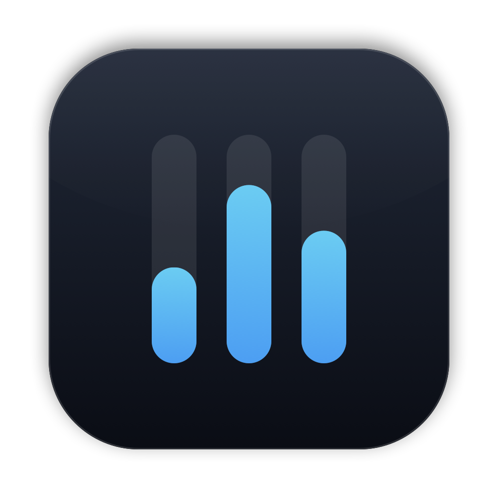
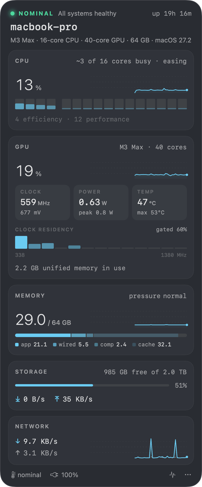

<p align="center">
  
</p>

<h1 align="center">Pulse</h1>

<p align="center"><b>Observability for a fleet of one.</b><br>
A quiet menu bar monitor for Apple Silicon Macs: CPU cores, GPU clocks and watts, memory pressure, disk and network.</p>

<p align="center">
  <a href="https://yask.dev/pulse">Website</a> ·
  <a href="https://github.com/yask123/pulse/releases/latest">Download</a> ·
  <a href="#install">Install</a>
</p>

<p align="center">
  
</p>

## Install

```bash
brew install --cask yask123/tap/pulse
```

Or download `Pulse-x.y.z.zip` from [Releases](https://github.com/yask123/pulse/releases/latest), unzip, and move `Pulse.app` to `/Applications`.

> Pulse is ad-hoc signed, not notarized. Homebrew clears the quarantine flag for you. With a manual download, right-click `Pulse.app` → **Open** the first time, or run `xattr -dr com.apple.quarantine /Applications/Pulse.app`.

**Requires** macOS 26 or later on Apple Silicon.

## What it shows

The menu bar icon is three slim gauges (CPU, memory, disk). They're monochrome while things are healthy, and a gauge takes on amber or red when that resource is under strain.

Click it for the panel:

| | |
|---|---|
| **Health** | One status light with the reason: memory pressure, swapping, thermal throttling, disk nearly full. |
| **CPU** | Total load with two minutes of history, one bar per core (efficiency and performance cores set apart), and demand in plain words, e.g. “~3 of 16 cores busy · easing”. |
| **GPU** | Model and core count, utilisation, clock and voltage, power in watts, die temperature, and **DVFS clock residency**: how long the GPU spent at each frequency step, plus how often it was power-gated. |
| **Memory** | Used vs. total, a memory-pressure chart, and what RAM actually holds: app, wired, compressed, cache. |
| **Storage** | Free space and live read/write throughput. |
| **Network** | Download and upload on physical interfaces (VPN tunnels excluded so traffic isn't double-counted). |

Click any number for a one-line explanation of what it means.

## How it works

Everything runs in-process as your user. There's no root, no privileged helper, and no network access.

| Metric | Source |
|---|---|
| CPU per-core load | `host_processor_info` |
| Memory, compressor, swap, pressure | `host_statistics64`, `vm.swapusage`, `kern.memorystatus_*` |
| Disk throughput | IOKit `IOBlockStorageDriver` statistics |
| Network | `NET_RT_IFLIST2` 64-bit interface counters |
| GPU utilisation and memory | IOKit `IOAccelerator` performance statistics |
| GPU clock residency and power | IOReport (`GPU Stats`, `Energy Model`), the private framework behind `powermetrics`, loaded at runtime |
| GPU frequency and voltage table | `pmgr` device-tree `voltage-states9` |
| GPU temperature | AppleSMC `Tg*` sensors |

IOReport and SMC aren't public APIs. If a future macOS moves them, those readouts show "—" and the rest keeps working.

Sampling runs every 2 seconds and costs about 0.1% of one core.

## Build from source

Needs Xcode 26+ command line tools.

```bash
git clone https://github.com/yask123/pulse && cd pulse
./build.sh --install        # build, copy to ~/Applications, launch
./build.sh --release 1.0.0  # versioned zip + sha256 for a release
```

`Tools/Snapshot.swift` renders the panel to PNG for design review:

```bash
swiftc -parse-as-library -D SNAPSHOT Sources/*.swift Tools/Snapshot.swift -o /tmp/snap && /tmp/snap docs
```

## License

MIT
